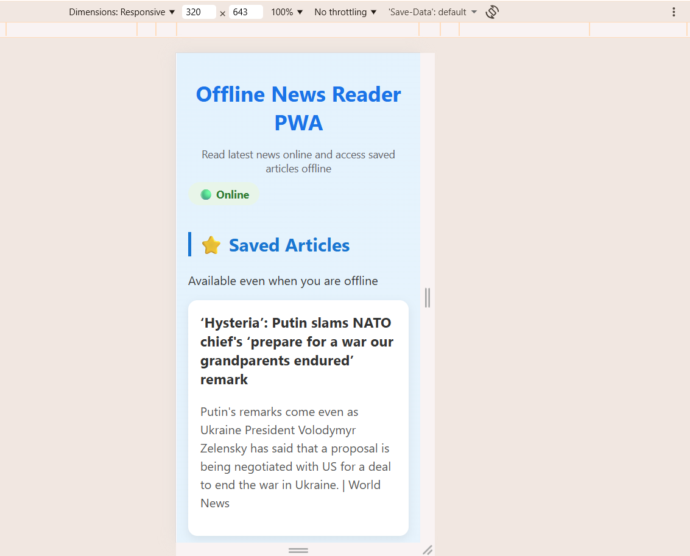
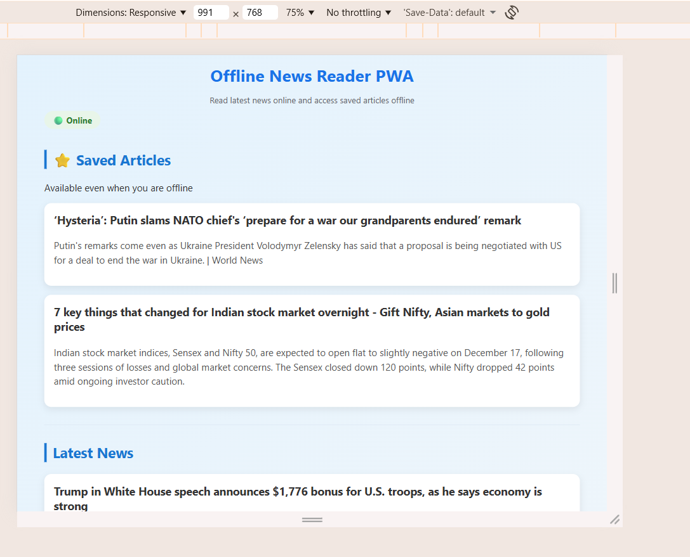
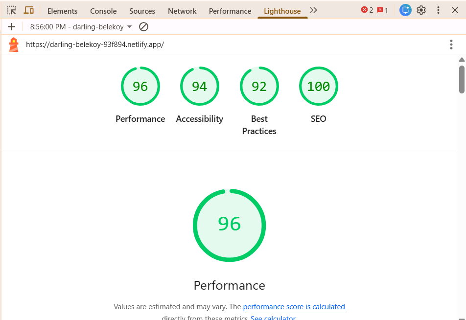

# 📰 Offline News Reader – Progressive Web App (PWA)

An offline-first **News Reader Progressive Web App** that allows users to read news articles online, save articles for offline access, and install the app on their device.  
The application works seamlessly in both online and offline modes and provides a smooth, app-like experience.

---

##  Features

-  Fetches latest news when online
-  Works offline using cached content
-  Bookmark articles for offline reading
-  Offline actions persist when back online
-  Installable as a Progressive Web App
- 🟢 Online / 🔴 Offline status indicator
-  Clean and responsive UI

---

##  Tech Stack

- **Frontend:** React (Create React App)
- **PWA:** Service Worker, Web App Manifest
- **Storage:** IndexedDB (for offline news caching and bookmarks)
- **API:** Public News API (GNews)
- **Deployment:** Netlify (or GitHub Pages / Vercel)

---

##  Project Structure

news-pwa/
│
├── public/
│ ├── manifest.json
│ ├── offline.html
│ └── icons/
│
├── src/
│ ├── App.js
│ ├── App.css
│ └── index.js
│
├── build/
├── README.md
└── package.json

---

##  Offline Strategy

- The application follows an **offline-first approach**
- Static assets are cached using a **Service Worker**
- Previously fetched news articles are stored in IndexedDB for reliable offline access
- When offline:
  - Cached news is displayed
  - Users can bookmark articles
- A custom `offline.html` page is served as a fallback when content is unavailable

---

##  Data Synchronization

- Bookmark actions performed while offline are stored in IndexedDB
- When the application comes back online:
  - Saved bookmarks remain available
  - No user data is lost
- This satisfies offline-to-online data synchronization without requiring a backend server

---

##  Add to Home Screen (PWA Install)

- The app can be installed using the browser install prompt
- Runs in standalone mode without address bar
- Installed app preserves previously saved data

---

##  How to Run Locally

```bash
npm install
npm start
```

**Open in browser:**

http://localhost:3000

## How to Test Offline

- Open the app in Chrome

- Open DevTools → Network

- Set No throttling → Offline

- Reload the page

**Verify:**

- Offline indicator appears

- Cached news is visible

- Bookmarks can be added

## Responsive Design

### Mobile View


### Desktop View



## Lighthouse Audit

- Lighthouse scores (Performance, Accessibility, Best Practices, SEO): 90+

- Meets installability, offline, and performance criteria





## Live Demo

- Live URL: https://darling-belekoy-93f894.netlify.app/

## Demo Video

- Link: https://drive.google.com/file/d/1yymDQmKBLwKQMC4fJNK5k_gsBiAXHCCa/view?usp=sharing

**A short demo video shows:** 

- Online and offline behavior
- Bookmarking while offline
- Data persistence when back online
- PWA installation

**Note:**
The live deployed version may not display news due to public API CORS or rate limits. 
However, the application logic for fetching, caching, offline access, bookmarking, 
and data persistence is fully implemented and demonstrated in the demo video and source code.


## Conclusion

This project demonstrates the core concepts of Progressive Web Apps including offline-first support using Service Workers and IndexedDB, data persistence, and installability, delivering a reliable and user-friendly experience.

## Security Improvements

- API keys are managed securely using environment variables (.env)
- Sensitive credentials are not hardcoded or committed to the repository